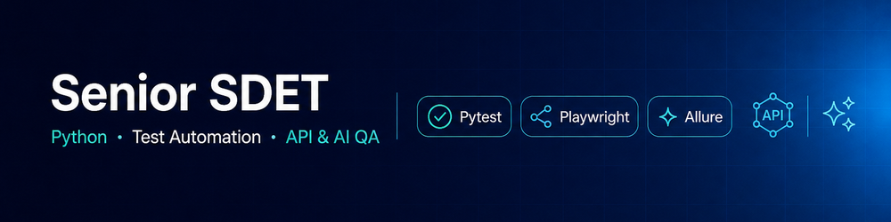
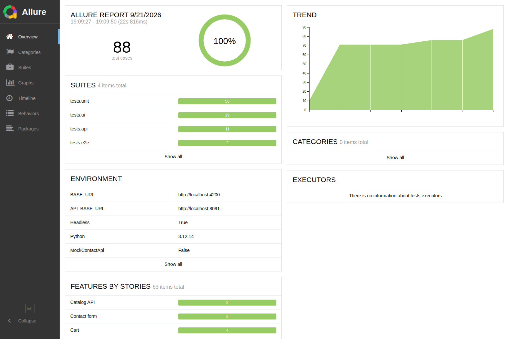
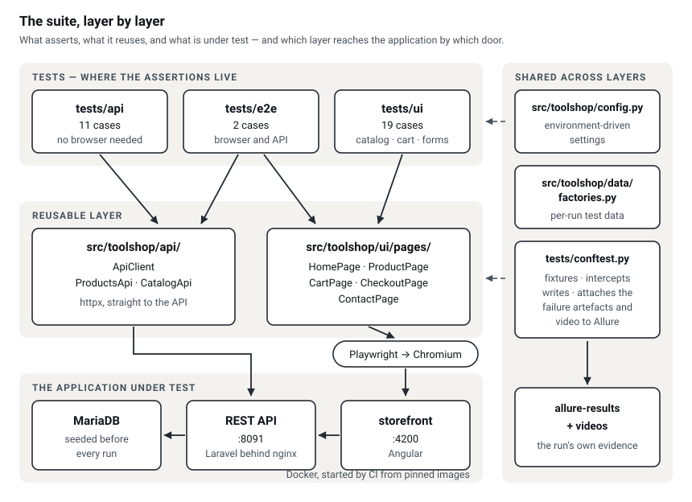

# Toolshop — Quality Engineering Project

[](https://github.com/WolfGung/Toolshop-Test-Automation-Framework/actions/workflows/tests.yml)
[](https://wolfgung.github.io/Toolshop-Test-Automation-Framework/report/)

**Start with the evidence:** [the live Allure report](https://wolfgung.github.io/Toolshop-Test-Automation-Framework/report/) of the
latest run on `main`, and [the checkout test as it runs](https://wolfgung.github.io/Toolshop-Test-Automation-Framework/#recording) —
both published by [the pipeline that had to pass first](https://wolfgung.github.io/Toolshop-Test-Automation-Framework/).

[](https://wolfgung.github.io/Toolshop-Test-Automation-Framework/report/)



A complete quality cycle for a web application, from reading an undocumented
product to a maintained automated suite: scope and requirement gaps, a
risk-ranked strategy, test design, and 32 automated cases across API, UI and
end-to-end layers.

**Application under test:** [practicesoftwaretesting.com](https://practicesoftwaretesting.com)
— a public demo storefront with a REST API, published as a practice target for
test automation. No employer code, data or systems are involved.

## Why this repository exists

Most automation portfolios show a folder of tests. The harder part of the job
happens before the first test is written: deciding what is worth covering,
at which layer, and what is deliberately left out. That reasoning is written
down here and each decision is traceable to the test that implements it.

| Document | Question it answers |
| --- | --- |
| [Scope and requirements](docs/01-scope-and-requirements.md) | What is under test, what is not, and which rules had to be derived because nothing documents them |
| [Risk analysis](docs/02-risk-analysis.md) | What breaks the business if it fails, and what that changes about coverage |
| [Test strategy](docs/03-test-strategy.md) | Which layer each check belongs at, and how a shared environment shapes the design |
| [Test design](docs/04-test-design-contact-form.md) | A worked example: equivalence classes and boundaries for one feature |
| [Defect reporting](docs/05-defect-reporting.md) | The template, plus a finding that was verified and closed rather than filed |
| [Environments and CI](docs/06-environments-and-ci.md) | Why the suite runs against two environments, what each is allowed to do, and how to read a skipped nightly run |

## Coverage

| Layer | Cases | Focus |
| --- | --- | --- |
| API | 11 | Pagination, schema, search, price filtering, error codes |
| UI | 19 | Catalog rendering, sorting, search, cart arithmetic, form validation |
| E2E | 2 | Guest checkout through to payment selection |
| Smoke (of the cases above) | 10 | The critical risks from the risk analysis, run on every deploy |

The suite also carries checks of its own tooling — configuration, and the
build of the showcase page. The [live report](https://wolfgung.github.io/Toolshop-Test-Automation-Framework/report/) counts
those apart from the coverage above, because they prove nothing about the
storefront.

## Stack

Python 3.11+ · Pytest · Playwright · httpx · Allure · Docker · GitHub Actions

## Architecture

```
src/toolshop/
  config.py          environment-driven settings
  api/               HTTP client and resource helpers
  data/factories.py  per-run test data
  ui/pages/          Page Object Model
tests/
  api/               API-only checks
  ui/                browser checks
  e2e/               full business flows
  conftest.py        fixtures, request interception, failure artefacts
docs/                the reasoning behind all of the above
```

Three decisions worth calling out:

**Locators are the application's own `data-test` attributes.** They are part
of the markup contract, so a copy change or a restyle does not turn into a
suite-wide failure.

**There are no fixed sleeps.** Sorting, searching and filtering refetch the
product grid; the suite waits for that response and then for the grid to
actually re-render, using a fingerprint of the rendered names. Waiting on the
response alone still races the render.

**Writes to the shared backend are intercepted by default.** The application
is public and used by other people. Contact form submissions are fulfilled in
the browser and the payload is asserted instead of being sent — which also
catches the bug class where a field is renamed or dropped on the way out. The
one test that places a real order is deselected by default.

## Two environments

The hosted storefront belongs to somebody else, so the suite treats it as
read-only: writes are intercepted and asserted instead of sent, and the one
test that places an order is opt in. The stand — the same application, started
from pinned images by `scripts/stand-up.sh` and seeded from scratch — is ours,
so there the write paths run for real.

That is also how the pipeline is split. The stand run is the gate on every
pull request and every push to `main`, because a failure there is always about
the code. The hosted site is watched nightly, and that run skips its browser
job, with a notice, when the site answers 403 to the runner's address range.

[Environments and CI](docs/06-environments-and-ci.md) sets out what each
environment is allowed to do, why the stand's images are pinned by digest, and
what a skipped nightly run does and does not mean.

## Running the suite

```bash
python -m venv .venv && source .venv/bin/activate
pip install -r requirements.txt
playwright install chromium

pytest                 # everything except tests that write data
pytest -m smoke        # the critical set
pytest -m api          # no browser needed, runs in seconds
pytest -m "ui or e2e"  # browser tests
pytest --headed        # watch it run
```

`make install`, `make smoke`, `make api`, `make report` wrap the same commands.

To run against the disposable stand instead of the hosted site — the way CI
runs it, writes included:

```bash
make stand       # start the application from pinned images and seed it
make stand-test  # every layer against it, writes and order placement included
make stand-down  # stop it and remove its data
```

### Configuration

Copy `.env.example` to `.env` to override any of:

| Variable | Default | Purpose |
| --- | --- | --- |
| `BASE_URL` | `https://practicesoftwaretesting.com` | Storefront |
| `API_BASE_URL` | `https://api.practicesoftwaretesting.com` | REST API |
| `HEADLESS` | `true` | Browser visibility |
| `SLOW_MO` | `0` | Milliseconds between actions, for debugging |
| `TIMEOUT_MS` | `30000` | Default wait for UI assertions |
| `MOCK_CONTACT_API` | `true` | Intercept writes instead of sending them |

The browser engine is chosen with `pytest --browser firefox` (or `webkit`).

### Opting into tests that write data

```bash
pytest -m creates_data
```

This places a real order on the shared demo backend. Run it deliberately.

## Reporting

Every run writes to `allure-results/`. A failing test attaches a full-page
screenshot, the page HTML, the URL and any console errors, so a red build in
CI can be diagnosed without reproducing it locally. Each run also records the
environment it ran in — the two base URLs, whether writes were intercepted,
the Python version — which the report shows as its Environment panel, so a
report read months later still says what it was run against.

```bash
allure serve allure-results
```

Failures are grouped by `allure/categories.json` into product defects,
timeouts, selector drift and infrastructure problems — the distinction that
decides who picks the failure up.

## Docker

```bash
docker compose run --rm tests              # smoke by default
docker compose run --rm tests pytest -m api
```

## CI

`.github/workflows/tests.yml` brings up the stand and runs every layer against
it on every pull request and every push to `main`. Tests get one rerun on
failure; a test that only passes on the rerun is still reported as flaky
rather than hidden. Allure results are uploaded as artefacts on every run,
including failures, and on `main` the same run publishes
[the showcase page and its report](https://wolfgung.github.io/Toolshop-Test-Automation-Framework/)
from its own results.

Nightly, and on demand, the workflow also runs against the hosted site: the
API suite, and the browser suite behind a reachability probe.

### The browser job is gated on reachability

The hosted storefront answers **HTTP 403** to GitHub-hosted runners — it blocks
data-centre IP ranges. A suite that reported this as 21 failing tests would be
lying: nothing about the product is broken, the environment simply cannot be
reached.

So a preflight job probes the storefront and the browser job runs only on a
200. Otherwise it is skipped with a notice explaining why. Nothing is gated on
that run — the stand run is the gate, and it does not depend on anyone else's
deployment.

Two things follow from this, and both are deliberate:

- **Browser tests are run locally**, where the site is reachable. `make ui`
  and `make e2e` do that.
- **When the app does not render, the suite says so.** Page objects wait for
  the application shell and fail with the navigation status and the contents
  of `app-root`, rather than with "element not found" on whichever locator the
  test happened to use first. That is how the 403 was identified in the first
  place.
